# 🛡️ Aegis — .NET 10 için Dayanıklılık (Resilience) Kütüphanesi

[](#-net-10-ve-modern-net)
[](#-net-10-ve-modern-net)
[](#-paketler)
[](#native-aot-ve-trimming)
[](LICENSE)

**Aegis**, .NET uygulamalarını bağımlılıklarının arızalarına karşı koruyan bir kütüphanedir. Kapsamı:
- **Temel stratejiler:** yeniden deneme, devre kesici, zaman aşımı, hız sınırı, hedging, yedek değer, önbellek, kaos.
- **Entegrasyonlar:** HTTP, gRPC, ASP.NET Core, SQL Server, Redis, OpenTelemetry ve .NET Aspire.

**Neden ayrı bir kütüphane:**
- **Kapsam:** Polly 8 ve Microsoft.Extensions.(Http.)Resilience'ın özellik setinin tamamını karşılar. Onlarda olmayanları da
  ekler: dağıtık devre kesici, adaptif eşzamanlılık, istek birleştirme, bayat veri, gRPC katmanında dayanıklılık, web panosu.
- **Hız:** .NET 10 üzerinde ölçülen 19 senaryonun 19'unda Polly'den hızlıdır. 16'sında başarılı çağrı **hiç bellek ayırmaz**.
- **Bağımlılık:** Çekirdek paket (`Aegis.Resilience.Core`) .NET 8+ hedeflerinde **hiçbir NuGet paketine bağlı değildir**.

```csharp
var pipeline = new AegisPipelineBuilder("odeme")
    .AddTimeout(TimeSpan.FromSeconds(10))
    .AddRetry(o => o.MaxRetryAttempts = 3)
    .AddCircuitBreaker()
    .Build();

var sonuc = await pipeline.ExecuteAsync(ct => odemeServisi.CekAsync(siparis, ct), cancellationToken);
```

---

## 📑 İçindekiler

1. [Neden Aegis?](#-neden-aegis)
2. [Mimari (diyagramlar)](#-mimari)
3. [.NET 10 ve modern .NET](#-net-10-ve-modern-net)
4. [Paketler](#-paketler)
5. [Hızlı başlangıç](#-hızlı-başlangıç)
6. [Stratejiler](#-stratejiler)
7. [HTTP entegrasyonu](#-http-entegrasyonu)
8. [gRPC](#-grpc)
9. [Sunucu tarafı koruma (ASP.NET Core, Web API 2)](#-sunucu-tarafı-koruma)
10. [Dağıtık durum (Redis)](#-dağıtık-durum-redis)
11. [Web panosu (Dashboard)](#-web-panosu-dashboard)
12. [Sağlık kontrolü](#-sağlık-kontrolü)
13. [Gözlemlenebilirlik: metrik, iz, günlük](#-gözlemlenebilirlik)
14. [Dependency Injection, yeniden yükleme, AOP](#-dependency-injection-yeniden-yükleme-aop)
15. [Test yazma](#-test-yazma)
16. [Doğrulama: gerçek proje ve testler](#-doğrulama)
17. [Proje yapısı ve belgeler](#-proje-yapısı-ve-belgeler)

---

## 💎 Neden Aegis?

Aşağıdaki tablo yalnızca **farkları** gösterir. Retry, devre kesici, timeout, hedging, telemetri, `TimeProvider` ve standart
HTTP işleyicisi her iki tarafta da var. Madde madde karşılaştırma: **[docs/POLLY-COMPARISON.md](docs/POLLY-COMPARISON.md)**.

| Kriter | Aegis 2.0.0 | Polly 8.8 / Microsoft.Extensions.Resilience 10.10 |
| :--- | :---: | :---: |
| **Performans (.NET 10, BenchmarkDotNet)** | 19 senaryonun 19'unda daha hızlı: tek iş parçacığında 0,30–0,98×, 64 iş parçacığında 0,08–0,69× | Referans |
| **Başarı yolunda bellek** | 19 senaryonun 16'sında **0 B**; hiçbirinde Polly'den fazla değil | 0–2.357 B |
| **Dağıtık devre kesici (pod'lar arası, Redis)** | ✅ Lua; kümede tek yarı açık deneme isteği | ❌ |
| **Küme genelinde hız sınırı (Redis)** | ✅ Kesintide pod başına yerel sınıra düşer | ❌ |
| **gRPC katmanında dayanıklılık** (`grpc-status` görür) | ✅ Unary + 3 akış türü, A6 commit kuralı, pushback, uç nokta ayıklama | ❌ HTTP katmanında kalır, gRPC hatasını görmez |
| **Yavaş çağrı oranı, gölge kip, sayı penceresi (resilience4j)** | ✅ | ❌ |
| **Adaptif eşzamanlılık (Netflix Gradient2)** | ✅ | ❌ |
| **İstek birleştirme (singleflight), bayat veri, önbellek** | ✅ Yerleşik | ❌ |
| **Ağırlıklı kanarya, çoklu veri merkezi hedging** | ✅ | ❌ |
| **Kötümser zaman aşımı (token'a saygısız kod)** | ✅ | ❌ (v8'de kaldırıldı) |
| **Idempotency-Key farkında HTTP koruması** | ✅ Anahtarsız POST asla yeniden gönderilmez | Anahtar farkındalığı yok |
| **Sunucu tarafı gelen istek hız sınırı** | ✅ `Aegis.Resilience.AspNetCore` (AspNetCoreRateLimit'ten 4× hızlı), `Aegis.Resilience.WebApi` | ❌ |
| **SQL Server geçici hata tanıma** | ✅ `Aegis.Resilience.Data.SqlClient` (EF Core ile aynı 175 hata) | ❌ |
| **Web panosu, sağlık kontrolü, AOP `[AegisPolicy]`** | ✅ | ❌ |
| **Fırlatan olay geri çağrısı / telemetri dinleyicisi** | ✅ Yutulur ve sayılır; çağrı etkilenmez | Polly: çağrıya yayılır |
| **İz (trace): boru hattı başına span** | ✅ `ActivitySource("Aegis")` | ❌ (yalnızca metrik) |
| **Platform** | .NET 10, 9, 8, .NET Framework 4.6.2+, netstandard2.0; Native AOT; strong naming | Aynı |
| **Üretim geçmişi / topluluk** | Yeni | **Yıllardır yaygın kullanımda** |

---

## 🏗️ Mimari

### Paketler ve bağımlılıkları

`Aegis.Resilience.Core` tüm stratejileri içerir ve .NET 8+ hedeflerinde dış bağımlılığı yoktur. Diğer paketler ihtiyaca göre eklenir.

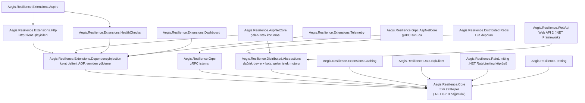

### Bir çağrının boru hattından geçişi

Stratejiler eklendiği sırayla **dıştan içe** sarar. Her katman bir sonrakini çağırır; hata katmanlar arasında istisna olarak
değil `Outcome<T>` değeri olarak taşınır ve yalnızca en dışta bir kez fırlatılır. Bu tasarım hem hızlıdır hem de bellek
ayırmaz.

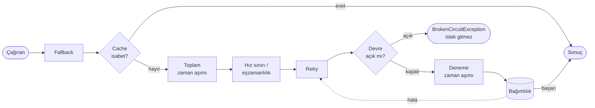

Önerilen sıra `AddStandardResilience` ile tek satırda kurulur: toplam zaman aşımı → eşzamanlılık → retry → devre kesici →
deneme zaman aşımı.

### Devre kesici durumları

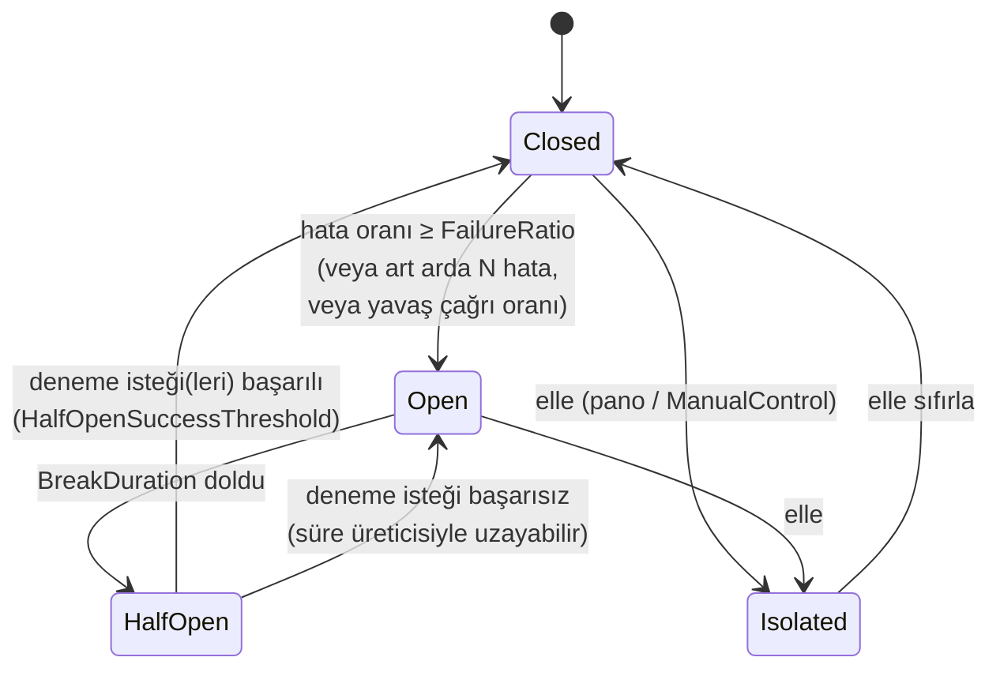

Yarı açık durumda **yalnızca tek deneme isteği** geçer; aynı anda gelen diğerleri hemen reddedilir. Böylece toparlanan servis
yeniden boğulmaz. Durum kimlikle izlenir: geç biten eski bir deneme, yeni denemenin kilidini açamaz.

### Dağıtık mimari: pod'lar ortak durumu paylaşır

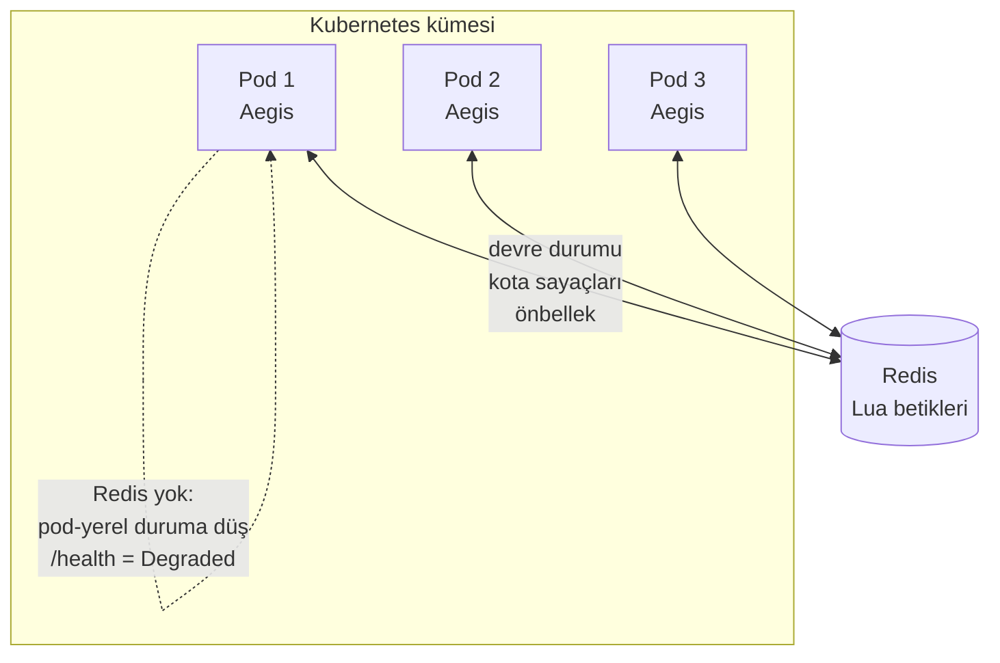

- **Ortak devre:** Pod 1'de açılan devre Pod 2 ve 3'te de açık görünür. Kümede yalnızca **tek** yarı açık deneme isteği geçer.
- **Ortak kota:** "Saniyede 50" sınırı 10 pod çalışırken de toplamda aşılmaz.
- **Ortak önbellek:** Bir pod'un önbelleğe aldığı değeri diğer pod'lar da kullanır.
- **Redis kesintisi:** Pod'lar yerel duruma düşer (fail-open, ama sınırsız değil) ve sağlık kontrolü bunu bildirir.

### HTTP yeniden deneme akışı (standart işleyici)

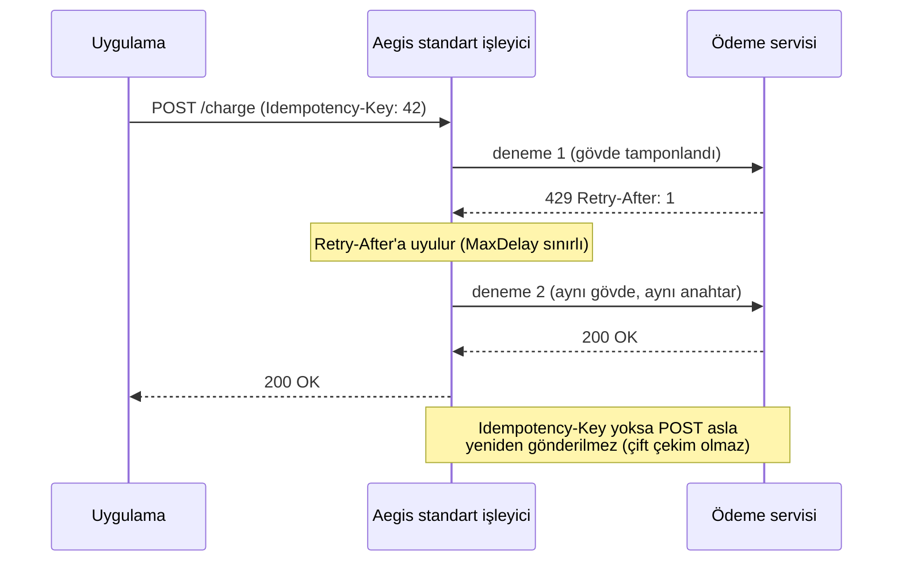

### gRPC: commit kuralı (gRPC A6)

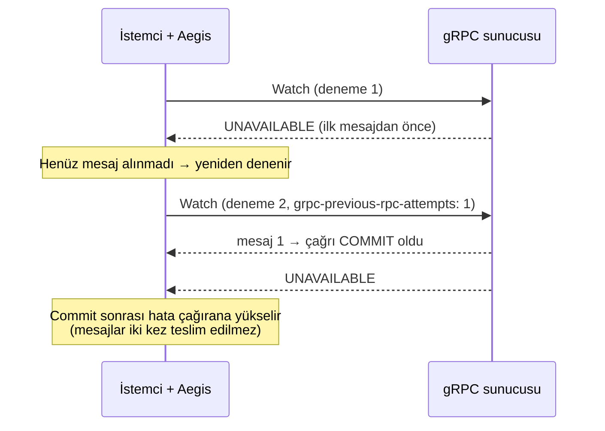

---

## ⚡ .NET 10 ve modern .NET

Aegis'in birincil hedefi .NET 10'dur. Ölçümler, optimizasyonlar ve gerçek proje doğrulaması .NET 10 üzerinde yapıldı. .NET 9
ve 8 aynı kodla tam desteklenir. .NET Framework ve netstandard2.0 desteği de var. NuGet her projeye kendi sürümüne uygun DLL'i
seçer; .NET 10 projesi .NET 10 için derlenmiş DLL'i alır.

### Hangi hedef ne alır

| Hedef | Ne alırsınız |
|---|---|
| **net10.0, net9.0** | Tam performans yolu. **`System.Threading.Lock`** her çağrıdaki kilitlerde kullanılır (`AegisLock`), `Monitor`'dan hafiftir. HTTP gövdesi tamponlanırken iptal token'ı da iletilir (`LoadIntoBufferAsync(…, ct)`). |
| **net8.0** | Aynı tam yol; kilit tipi nesne kilidi. Bunun dışında net9/net10 ile aynı. |
| **netstandard2.0, net462** | Aynı API ve davranış. Eksik BCL API'leri dahili polyfill'lerle karşılanır. Farklar platformdan gelir: `CancellationTokenSource.TryReset` olmadığı için zaman aşımı kaynakları havuzlanmaz. `HttpRequestException` durum kodu taşımaz. |

Kaynak kod tüm hedeflerde aynıdır. Platforma özel kod yalnızca birkaç yerdedir ve davranışı değil maliyeti değiştirir:
`#if NET9_0_OR_GREATER` (2 yer), `#if NET` (9 yer), `AEGIS_LEGACY` (24 yer).

### Sıfır tahsis nasıl sağlanıyor

Başarılı bir çağrının bellek ayırmaması testlerle kilitlidir: bir değişiklik tahsis yaparsa test kırılır. Kullanılan teknikler:

| Teknik | Nerede | Etkisi |
|---|---|---|
| **`Outcome<T>`** (istisna yerine değer) | Tüm stratejiler | Katmanlar arasında istisna fırlatılmaz; hata yolunda da yığın izi bir kez oluşur |
| **`ValueTask` + eşzamanlı hızlı yol** | Her strateji | Geri çağrı hemen biterse `async` durum makinesi hiç kurulmaz |
| **`PoolingAsyncValueTaskMethodBuilder`** (.NET 8+) | Retry, devre kesici, timeout, adaptif | Beklemeli yolda bile durum makinesi kutusu havuzdan gelir |
| **Durumlu statik geri çağrılar (`TState`)** | Boru hattı zinciri, HTTP, gRPC | Closure ve delegate tahsisi yok |
| **Havuzlanmış `AegisContext`** | Her çağrı | İş parçacığı başına önbellek yuvası (`[ThreadStatic]`) + paylaşılan havuz; çekişme yok |
| **Havuzlanmış `CancellationTokenSource`** (`TryReset`) | Zaman aşımı, hedging | Zaman aşımı başına kaynak ayrılmaz |
| **`UnsafeRegister`** | İptal kayıtları | `ExecutionContext` yakalanmaz |
| **`Stopwatch.GetElapsedTime`** | Süre ölçümü | Duvar saati değil, monotonik saat; NTP sıçramalarından etkilenmez |
| **Kilitsiz sayaçlar (`Interlocked`)** | Eşzamanlılık sınırlayıcı | 64 iş parçacığında Polly'den 5× hızlı |

.NET 10'da DATAS (dinamik çöp toplayıcı ayarı) varsayılan olarak açıktır. Yığını uygulamanın gerçek ihtiyacına göre
küçültür; bu yüzden sıcak yolda bellek ayırmamak konteynerlerde daha da değerlidir.

### .NET 10 ölçümleri (Polly 8.8 ile aynı koşu)

| Senaryo | Polly | Aegis | Süre oranı | Bellek (Polly → Aegis) |
|---|---:|---:|---:|---|
| Standart zincir (5 strateji) | 1.567 ns | 1.011 ns | **0,64×** | 48 B → **0 B** |
| Retry, başarı | 354 ns | 169 ns | **0,48×** | 24 B → **0 B** |
| Devre kesici, kapalı | 399 ns | 164 ns | **0,41×** | 24 B → **0 B** |
| Eşzamanlılık sınırı | 304 ns | 91 ns | **0,30×** | 40 B → **0 B** |
| Hedging | 609 ns | 276 ns | **0,45×** | 0 B → 0 B |
| 64 iş parçacığı: eşzamanlılık sınırı | 952 ns | 178 ns | **0,19×** | 40 B → **0 B** |
| 64 iş parçacığı: retry | 248 ns | 20 ns | **0,08×** | 24 B → **0 B** |
| Sunucu hız sınırı (AspNetCoreRateLimit ile) | 3.792 ns | 959 ns | **0,25×** | 4.704 B → 1.600 B |
| gRPC interceptor, standart zincir | 2.095 ns | 2.000 ns | 0,95× | 720 B → 688 B |

Tüm sonuçlar ve yöntem: **[docs/BENCHMARKS.md](docs/BENCHMARKS.md)**.

### Native AOT ve trimming

- **Analizörler:** .NET 8+ hedeflerinde `IsAotCompatible` açıktır. Trim ve AOT analizörlerinin uyarıları **derlemeyi kırar**.
- **Yansımasız serileştirme:** Pano JSON'u ve dağıtık önbellek deposu kaynak üreticili JSON (`JsonSerializerContext`) kullanır.
- **Doğrulama:** `tests/Aegis.AotSmokeTest`, .NET çalışma zamanı içermeyen bir Docker imajında koşar ve gerçek bir
  OpenTelemetry Collector'a veri gönderir.
- **İstisna:** AOT ile uyumsuz tek özellik `DispatchProxy` tabanlı AOP'dir (`AddAegisProxied*`). Bu açıkça
  `[RequiresDynamicCode]` ile işaretlidir ve derleyici uyarır.

### C# 14 ve derleme kalitesi

- **Dil sürümü:** `LangVersion 14`. Eski hedefler için polyfill'ler C# 14 *extension member* özelliğiyle yazılmıştır; kaynak
  kod iki dünyada aynı kalır.
- **Kalite kapıları:**
  - `TreatWarningsAsErrors` ve `AnalysisLevel latest-recommended`: derleme 0 uyarı, 0 hata.
  - Genel API dosyaları (`PublicAPI.*.txt`): kazara kırıcı değişiklik derlenmez.
- **Paket kimliği:** Strong-name imzalı derlemeler, deterministik derleme, sembol paketleri (`.snupkg`), Source Link.

---

## 📦 Paketler

Yalnızca ihtiyacınız olanı kurun:

| Paket | Ne zaman | Hedefler |
|---|---|---|
| **Aegis.Resilience.Core** | Her zaman: tüm stratejiler | net10/9/8, netstandard2.0, net462 |
| Aegis.Resilience.Extensions.DependencyInjection | DI, adlandırılmış boru hatları, AOP, yeniden yükleme | net10/9/8, ns2.0, net462 |
| Aegis.Resilience.Extensions.Http | `HttpClient` | net10/9/8, ns2.0, net462 |
| Aegis.Resilience.Grpc | gRPC istemcisi | net10/9/8, ns2.0, net462 |
| Aegis.Resilience.Grpc.AspNetCore | gRPC sunucusu | net10/9/8 |
| Aegis.Resilience.AspNetCore | Gelen istek hız sınırı, uç nokta boru hattı | net10/9/8 |
| Aegis.Resilience.WebApi | Klasik ASP.NET Web API 2 | net462 (.NET Framework) |
| Aegis.Resilience.Distributed.Abstractions | Dağıtık devre/kota soyutlamaları, bellek içi depolar | net10/9/8, ns2.0, net462 |
| Aegis.Resilience.Distributed.Redis | Redis depoları | net10/9/8, ns2.0, net462 |
| Aegis.Resilience.Extensions.Caching | `IDistributedCache` önbellek deposu | net10/9/8, ns2.0, net462 |
| Aegis.Resilience.Extensions.HealthChecks | Sağlık kontrolü | net10/9/8, ns2.0, net462 |
| Aegis.Resilience.Extensions.Dashboard | Web panosu | net10/9/8 |
| Aegis.Resilience.Extensions.Telemetry | `error.type`, `request.name` etiketleri | net10/9/8 |
| Aegis.Resilience.Extensions.Aspire | .NET Aspire ServiceDefaults | net10/9/8 |
| Aegis.Resilience.Data.SqlClient | SQL Server geçici hata tanıma | net10/9/8, ns2.0, net462 |
| Aegis.Resilience.RateLimiting | .NET `System.Threading.RateLimiting` köprüsü (isteğe bağlı) | net10/9/8, ns2.0, net462 |
| Aegis.Resilience.Testing | Testte boru hattı yapılandırmasını doğrulama | net10/9/8, ns2.0, net462 |

`Aegis.Resilience.WebApi` yalnızca .NET Framework'tedir; Web API 2 başka bir platformda çalışmaz. .NET 8+ için aynı işi
`Aegis.Resilience.AspNetCore` yapar.

---

## 🚀 Hızlı başlangıç

### 1. Boru hattı kur ve çalıştır

```csharp
using Aegis.Resilience.Core.Pipeline;
using Aegis.Resilience.Core.Strategies.Retry;

var pipeline = new AegisPipelineBuilder("siparis")          // Singleton: uygulama ömrü boyunca yaşasın
    .AddTimeout(TimeSpan.FromSeconds(30))                   // en dış: tüm denemeler dahil toplam süre
    .AddConcurrencyLimiter(maxConcurrent: 50)
    .AddRetry(o =>
    {
        o.MaxRetryAttempts = 3;
        o.BackoffType = DelayBackoffType.DecorrelatedJitter;
        o.Delay = TimeSpan.FromMilliseconds(200);
    })
    .AddCircuitBreaker(o => { o.FailureRatio = 0.5; o.MinimumThroughput = 10; o.BreakDuration = TimeSpan.FromSeconds(15); })
    .AddTimeout(TimeSpan.FromSeconds(5))                    // en iç: tek denemenin süresi
    .Build();

var siparis = await pipeline.ExecuteAsync(ct => servis.OlusturAsync(istek, ct), httpContext.RequestAborted);
```

Çalıştırma biçimleri aynı çekirdekten geçer:
- **Bağlamlı:** `ExecuteAsync(ctx => …, ctx)`.
- **Yalnızca token:** `ExecuteAsync(ct => …, ct)`.
- **Closure'suz durumlu:** `ExecuteAsync(static (ctx, s) => …, durum)`.
- **Fırlatmayan:** `ExecuteOutcomeAsync`.
- **Senkron:** `Execute(…)`.
- **Tipli boru hattı:** `Build<Siparis>()` ya da `AsTyped<Siparis>()`.

### 2. DI ve HttpClient (Microsoft `AddStandardResilienceHandler` eşdeğeri)

```csharp
builder.Services.AddAegis();
builder.Services.AddAegisPipeline("stok", p => p.AddRetry().AddCircuitBreaker());

builder.Services.AddHttpClient("odeme", c => c.BaseAddress = new Uri("https://odeme"))
    .AddStandardAegisHandler(o =>
    {
        o.Retry.MaxRetryAttempts = 3;
        o.AttemptTimeout.Timeout = TimeSpan.FromSeconds(2);
        o.TotalRequestTimeout.Timeout = TimeSpan.FromSeconds(10);
    });
```

### 3. Pano ve sağlık kontrolü

```csharp
builder.Services.AddHealthChecks().AddAegisCheck();

var app = builder.Build();
app.MapHealthChecks("/health");
app.MapAegisDashboard("/aegis", authorizationPolicy: "OpsReadOnly", actionAuthorizationPolicy: "OpsAdmin");
app.Run();
```

### 4. .NET Aspire

```csharp
builder.AddAegisServiceDefaults();   // tüm HttpClient'lara standart işleyici + Aegis metrikleri/izleri + sağlık kontrolü
```

Her özelliğin tüm seçenekleri, varsayılanları ve fırlattığı istisnalar: **[docs/USAGE.md](docs/USAGE.md)**.

---

## 🧩 Stratejiler

| Strateji | Ne yapar | Öne çıkan |
|---|---|---|
| **Retry** | Geçici hatada yeniden dener | Sabit / doğrusal / üstel / AWS Decorrelated Jitter; `Retry-After`'a uyar; **retry bütçesi** (gRPC throttling) bağımlılık çökerken retry fırtınasını keser; retler (açık devre, kota) asla yeniden denenmez |
| **Circuit Breaker** | Çöken servise istek göndermeyi keser | Kayan zaman penceresi ya da **son N çağrı**; art arda hata eşiği; **yavaş çağrı oranı**; tek deneme isteği; **gölge kip** (izle, reddetme); `HalfOpenSuccessThreshold`; sağlık bilgisine göre açılma süresi; elle izole / sıfırla |
| **Timeout** | Süreyi sınırlar | İyimser (token) ve **kötümser** (token'a saygısız kodu terk eder); `TimeoutGenerator` ile istek bütçesi |
| **Concurrency Limiter** | Aynı anda en fazla N iş | Varsayılan anında red; isteğe bağlı sınırlı kuyruk |
| **Rate Limiter** | Zaman başına kota | Token bucket, kayan pencere, **kiracı başına** (bellek korumalı); `RetryAfter` taşır |
| **Adaptive Concurrency** | Limiti gecikmeye göre kendisi ayarlar | Netflix Gradient2; tek aykırı örneğe dayanıklı |
| **Hedging** | Yavaş birincile paralel yedek istek | Sonuca göre hedging; `ActionGenerator` ile yedek başka bölgede; kaybeden yanıtlar dispose edilir |
| **Request Collapser** | Aynı anda gelen aynı istekleri tek çağrıya indirir | Çağıranlar arası iptal yalıtımı |
| **Fallback** | Hata anında yedek değer | İstisnaya ve sonuca göre |
| **Stale-While-Revalidate** | Bayat veriyi anında verir, arkada yeniler | Anahtar başına tek yenileme; çöküşte bayat veri |
| **Cache** | Önbellek | Bellek içi (gerçek LRU) ya da dağıtık (`IDistributedCache`); sabit / kayan / sonuca göre süre; depo hatası çağrıyı düşürmez |
| **Chaos** | Yapay arıza (Simmy eşdeğeri) | Hata, gecikme, sahte sonuç, yan etki; ağırlıklı sonuç üretici; yapılandırmadan canlı aç/kapat |

### Hız sınırını tek başına kullanma

Aegis'in hız sınırlayıcıları kendi kodumuzdur; Microsoft'un `System.Threading.RateLimiting` paketine ihtiyaç duymaz. Retry,
devre kesici gibi stratejileri hiç kullanmadan yalnızca hız sınırı için Aegis'i alabilirsiniz:

| İhtiyaç | Paket | Örnek |
|---|---|---|
| Kodda kota (token bucket, kayan pencere, kiracı başına, eşzamanlılık, adaptif) | `Aegis.Resilience.Core` (.NET 8+: 0 bağımlılık) | `new AegisPipelineBuilder("sms").AddRateLimiter(100, TimeSpan.FromMinutes(1)).Build()` |
| Tüm pod'larda ortak kota | `+ Aegis.Resilience.Distributed.Redis` | `.AddDistributedRateLimiter(store, o => o.PermitLimit = 50)` |
| ASP.NET Core'a gelen istekleri sınırlama | `Aegis.Resilience.AspNetCore` | `AddAegisInboundRateLimiting(...)` + `UseAegisInboundRateLimiting()` |
| Klasik ASP.NET Web API 2 | `Aegis.Resilience.WebApi` | `config.UseAegisRateLimiting(...)` |
| .NET'in hazır sınırlayıcıları (isteğe bağlı köprü) | `Aegis.Resilience.RateLimiting` | `.AddTokenBucketRateLimiter(new TokenBucketRateLimiterOptions { ... })` |

**Eşzamanlılık güvenliği.** Tüm sınırlayıcılar aynı boru hattı örneğini paylaşan çok sayıda iş parçacığı için güvenlidir
(boru hattını singleton kullanın). Kota hiçbir yarışta aşılmaz; bu testle kilitlidir:
- **Bellek içi:** 64 iş parçacığı × 50 çağrı aynı anda gönderilir. Token bucket, kayan pencere ve dağıtık bellek içi depo
  (3 algoritma) **tam olarak** izin sayısı kadar çağrı geçirir. Kiracı başına sınırlayıcıda her kiracı tam kendi kotasını alır.
- **Redis:** 4 ayrı pod bağlantısı × 32 iş parçacığı, 1.280 eşzamanlı istek gönderir; üç algoritmada da tam 100 istek geçer.
- **Eşzamanlılık ve adaptif sınırlayıcı:** Fırtınada sınır aşılmaz, izin sızmaz.

Zaman tabanlı sınırlayıcılar kısa bir `lock` ile kesinlik sağlar; eşzamanlılık sınırlayıcısı kilitsizdir.

---

## 🌐 HTTP entegrasyonu

| Özellik | API |
|---|---|
| Microsoft standart işleyicisinin eşdeğeri (aynı varsayılanlar) | `AddStandardAegisHandler(o => …)` / `(IConfigurationSection)` / `((o, sp) => …)` |
| Standart hedging + yönlendirme grupları + uç nokta başına devre | `AddStandardAegisHedgingHandler` |
| Hedef sunucu başına ayrı devre ve kota | `o.SelectPipelineByAuthority()` |
| **Idempotency koruması** | `Idempotency-Key`'siz POST/PATCH asla yeniden gönderilmez |
| Yönteme göre yeniden denemeyi kapatma | `o.DisableRetryFor(HttpMethod.Delete)` |
| Denemeler tükenince son yanıtı döndür (Microsoft davranışı) | `o.ReturnFinalResponse = true` |
| `Retry-After` (saniye ya da HTTP tarihi, `MaxDelay` ile sınırlı) | Otomatik |
| Gövde tekrar oynatma (geri sarılamayan akış dahil, boyut sınırlı) | Otomatik; tek başına `AddHttpRequestReplayHandler()` |
| Çoklu veri merkezi hedging | `AddMultiEndpointHedgingHandler` |
| Ağırlıklı kanarya + yapışkan oturum | `AddWeightedCanaryHandler` |
| İstek ya da host'a göre boru hattı | `AddAegisDynamicHandler`, `AddAegisHandlerByHost` |
| Kayıt defterindeki ya da satır içi boru hattı | `AddAegisResilienceHandler("ad")` / `(p => …)` / `((p, ctx) => …)` |
| Varsayılan işleyiciyi tek istemciden kaldırma | `RemoveAllAegisHandlers()` |
| Çağıranın bağlamını isteğe taşıma | `request.SetAegisContext(ctx)` |
| Senkron `HttpClient.Send` | Desteklenir |
| gRPC isteklerine dokunmaz | HTTP işleyicileri `application/grpc`'yi olduğu gibi geçirir |

---

## 🔌 gRPC

HTTP katmanındaki dayanıklılık gRPC'de çalışmaz. gRPC hatası `grpc-status` trailer'ındadır ve yanıt HTTP 200 döner; HTTP
işleyicisi bu hatayı başarı sanar. Aegis dayanıklılığı bu yüzden **gRPC katmanında** (interceptor) uygular.

```csharp
// İstemci
services.AddGrpcClient<Stok.StokClient>(o => o.Address = new Uri("https://stok"))
    .AddStandardAegisGrpcResilience(o => o.Retry.Budget = new RetryBudget())  // gRPC retry throttling
    .AddAegisGrpcOutlierDetection();                                          // bozuk sunucuyu havuzdan çıkar (.NET 8+)

// Sunucu
services.AddGrpc(o => o.AddAegisResilience(p => p.AddConcurrencyLimiter(200).AddTimeout(TimeSpan.FromSeconds(5))));
```

- **Çağrı türleri:** Unary, sunucu akışı, istemci akışı ve çift yönlü akış. Akışlarda gönderilen mesajlar tamponlanır ve yeniden
  denemede baştan oynatılır; tampon sınırı aşılınca çağrı commit olur.
- **Commit kuralı (gRPC A6):** İlk yanıt mesajından sonra çağrı yeniden denenmez.
- **Deadline:** Tüm denemeleri kapsar.
- **Sunucu bildirimleri:** `grpc-retry-pushback-ms` (sunucunun "şu kadar sonra dene" bildirimi) uygulanır;
  `grpc-previous-rpc-attempts` gönderilir.
- **Yeniden denenen durumlar:** Yalnızca `Unavailable` ve pushback'li `ResourceExhausted`. İstemci hataları yeniden denenmez.
- **Uç nokta ayıklama:** Art arda hata veren sunucu yük dengelemeden geçici olarak çıkarılır (Envoy varsayılanları).
- **Sunucu koruması:** Retler istemcinin anladığı gRPC durumuyla döner. Retry/Hedging içeren sunucu boru hattı reddedilir.
- **Protobuf:** Grpc.Tools ile üretilen kodla ve `WriteAsync(mesaj, ct)` ile doğrulandı.

---

## 🛂 Sunucu tarafı koruma

```csharp
builder.Services.AddAegisInboundRateLimiting(builder.Configuration.GetSection("Kota"), o => o.PartitionByHeader("X-ClientId"));
builder.Services.AddAegisPipeline("rapor", p => p.AddConcurrencyLimiter(20).AddTimeout(TimeSpan.FromSeconds(10)));

app.UseAegisInboundRateLimiting();
app.UseRouting();
app.UseAegisInboundPipelines();
app.MapGet("/rapor/yillik", RaporUret).RequireAegisPipeline("rapor");
```

- **Gelen istek hız sınırı:**
  - IP, başlık ya da kullanıcı başına kota; `GET:/api/*` gibi uç nokta desenleri.
  - IP (CIDR), istemci ve uç nokta beyaz listeleri.
  - `RateLimit-*` ve `Retry-After` başlıkları; `appsettings.json`'dan yeniden yükleme.
  - Redis ile tüm örneklerde ortak kota; gRPC isteğine HTTP 429 yerine gRPC durumu döner.
- **Uç nokta boru hattı:**
  - Gelen isteğe eşzamanlılık sınırı, zaman aşımı ve devre kesici; sonuç 429 / 504 / 503.
  - Zaman aşımı uç noktayı gerçekten iptal eder.
- **.NET Framework:** `config.UseAegisRateLimiting(...)` (`Aegis.Resilience.WebApi`), aynı kural motoru ve aynı Redis deposu.

---

## 🗄️ Dağıtık durum (Redis)

```csharp
builder.Services.AddAegisRedisStateStore("redis:6379");
builder.Services.AddAegisRedisRateLimitStore("redis:6379");
builder.Services.AddAegisPipeline("odeme", (p, sp) => p
    .AddDistributedRateLimiter(sp.GetRequiredService<IDistributedRateLimitStore>(), o => { o.LimiterKey = "stripe"; o.PermitLimit = 50; })
    .AddDistributedCircuitBreaker(sp.GetRequiredService<ICircuitBreakerStateStore>(), o => o.CircuitKey = "odeme"));
```

- **Atomiklik:** Her karar tek bir atomik Lua betiğidir. Saat olarak Redis `TIME` kullanılır; pod saat farkları sonucu etkilemez.
- **Devre geçişleri:** Açık → yarı açık geçişi Redis TTL'inden türetilir. Kümede tek deneme isteği `SET NX` kiralamasıyla geçer.
- **Geç bağlanan Redis:** Redis'ten önce açılan pod beklemez; bağlantı arka planda kurulur. Bu sürede `/health` **Degraded**
  döner; Kubernetes readiness kontrolü için kullanın.
- **Yavaş Redis:** Her işlem 250 ms ile sınırlıdır; yavaşlayan Redis korunan çağrıya gecikme eklemez.
- **Doğrulanan sürümler:** Redis 6.2, 7, 8, Valkey 8 ve şifreli Redis.

---

## 📊 Web panosu (Dashboard)

`Aegis.Resilience.Extensions.Dashboard` (.NET 8+), çalışan uygulamadaki tüm boru hatlarının dayanıklılık durumunu gösteren ve devre
kesicilere elle müdahale etmeyi sağlayan, dış bağımlılığı olmayan bir web sayfasıdır.

### Ekran görüntüleri

Aşağıdaki görüntülerin hepsi gerçek. Aynı uygulama (.NET 10, 6 boru hattı) her anda gerçek çağrılarla o duruma getirildi;
canlandırma ya da elle düzenleme yok.

**Kesinti anı.** Stok ve bildirim servisleri art arda hata verdi; devreleri gerçekten açıldı ve kırmızı **AÇIK** görünüyor.
Bu hatlara giden istekler bağımlılığa ulaşmadan hemen reddediliyor. Diğer dört hat etkilenmeden çalışıyor.

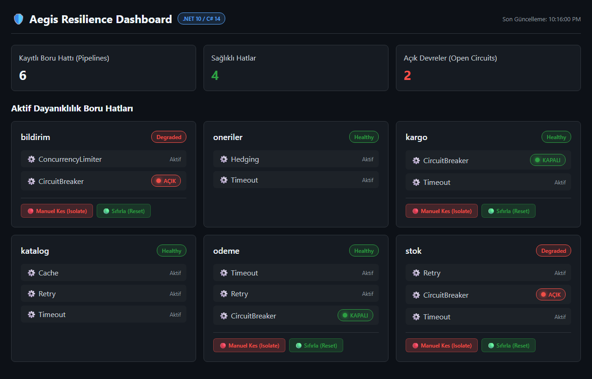

<table>
<tr>
<td width="50%"><b>Her şey sağlıklı.</b> Tüm devreler <b>KAPALI</b>; önbellek, hedging ve zaman aşımı içeren hatlar aktif.<br/>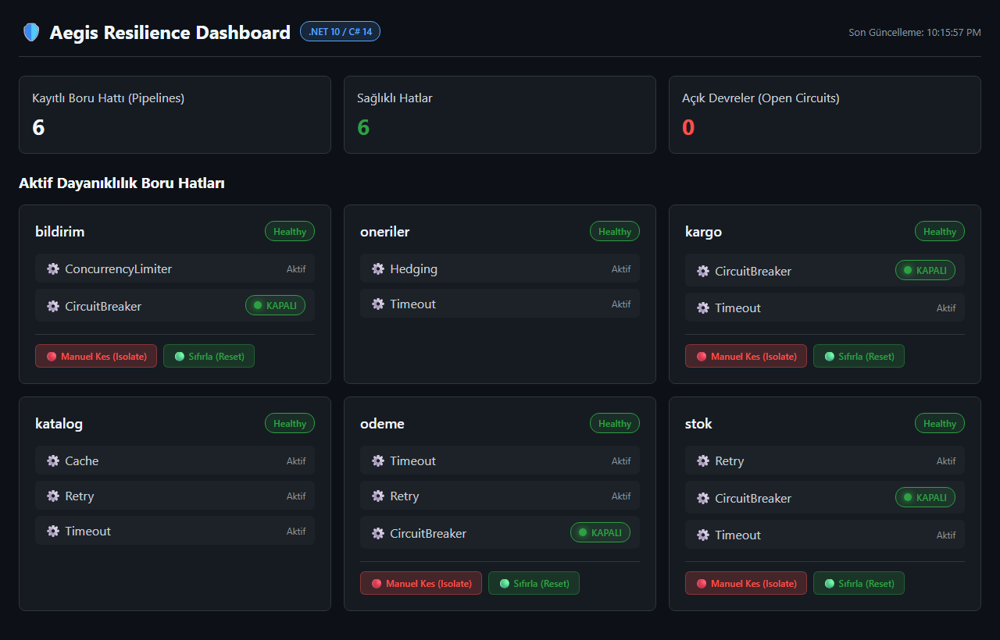</td>
<td width="50%"><b>Toparlanma.</b> Açık kalma süresi doldu; stok devresi <b>YARI AÇIK</b>, servisin düzelip düzelmediğini tek bir deneme isteğiyle sınamayı bekliyor.<br/>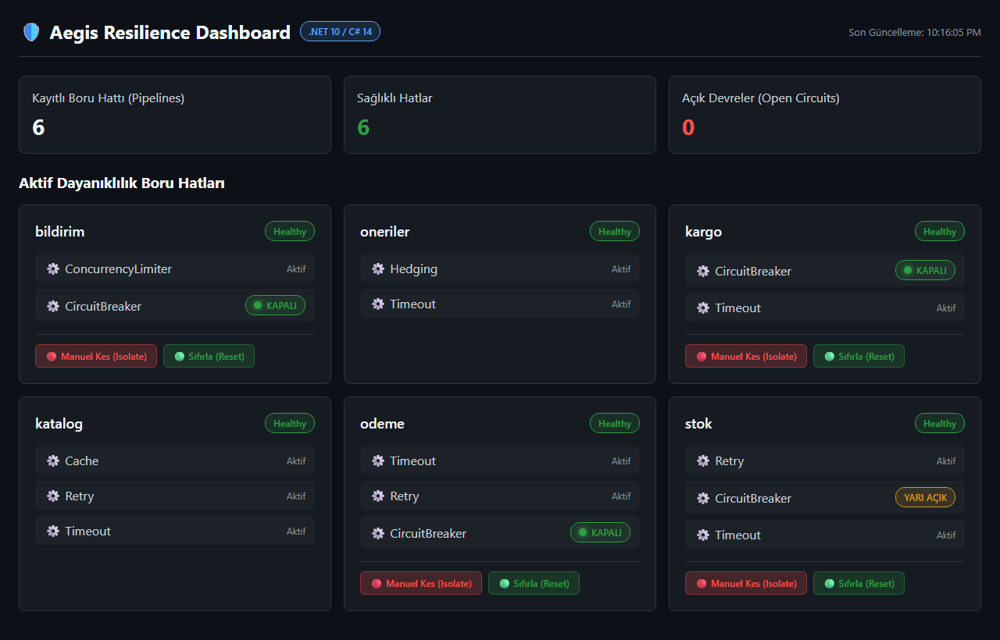</td>
</tr>
<tr>
<td width="50%"><b>Bakım modu.</b> Kargo ve ödeme <code>CircuitBreakerManualControl</code> ile tek hamlede izole edildi. Mavi <b>İZOLE (bakım)</b> etiketi, bilerek kesilen devreyi çöken servisten ayırır.<br/>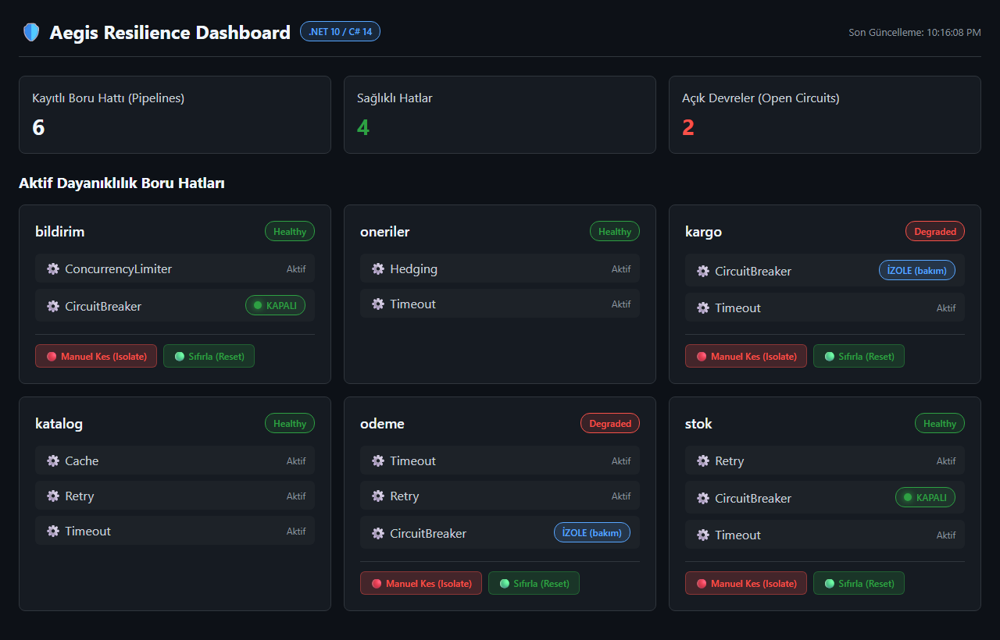</td>
<td width="50%"><b>Telefonda.</b> Kesinti anı, 390 px genişlikte. Kartlar alt alta dizilir, hiçbir şey taşmaz; nöbetçi operatör telefondan durumu görüp müdahale edebilir.<br/>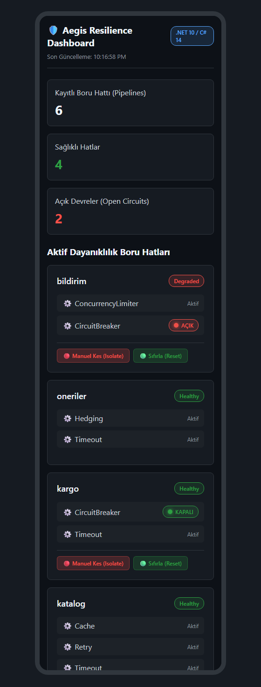</td>
</tr>
</table>

```csharp
app.MapAegisDashboard("/aegis",
    authorizationPolicy: "OpsReadOnly",        // panoyu ve durum JSON'unu görme
    actionAuthorizationPolicy: "OpsAdmin");    // Isolate / Reset (daha kısıtlı)

app.MapAegisStatus("/ops/aegis-status");       // yalnızca JSON (izleme sistemleri için)
```

### Ne gösterir

- **Görünüm:** Koyu temalı tek bir sayfa. Her 3 saniyede durum uç noktasını yeniden okur; sayfayı yenilemek gerekmez.
- **Boru hattı kartı:** Kayıt defterindeki her boru hattı için bir kart:
  - adı ve genel durumu (**Healthy** ya da devre açıksa **Degraded**),
  - içindeki stratejiler (Retry, CircuitBreaker, Timeout…),
  - her devre kesicinin anlık durumu: **KAPALI** (yeşil), **AÇIK** (kırmızı), **YARI AÇIK** (sarı), **İZOLE (bakım)** (mavi).
    Elle izole edilen devre, çöken bir servisin açılan devresinden ayrı bir etiketle gösterilir.
- **Kapsam:** Yerel devre kesiciler ve Redis üzerindeki **dağıtık** devre kesiciler birlikte görünür.
- **Müdahale düğmeleri:**
  - **🔴 Manuel Kes (Isolate):** Devreyi elle açar (bakım modu). İstekler bağımlılığa gitmez, `IsolatedCircuitException` alır.
  - **🟢 Sıfırla (Reset):** Devreyi kapatır ve hata penceresini sıfırlar.
- **Bağlantılı davranışlar:**
  - Elle yapılan geçişler `OnOpened` / `OnClosed` olaylarını `IsManual = true` ile tetikler; metrik ve günlüklere düşer.
  - İzole edilen devre `/health` çıktısında **Degraded** olarak görünür.
- **Sınır:** Pano grafik çizmez. Zaman serisi ve geçmiş için metrikleri Prometheus / Grafana / Aspire panosuna gönderin
  ([Gözlemlenebilirlik](#-gözlemlenebilirlik)).

### Uç noktalar

| Yöntem | Yol | Ne |
|---|---|---|
| `GET` | `/aegis` | HTML arayüz |
| `GET` | `/aegis/status` | Durum JSON'u |
| `POST` | `/aegis/circuits/{boru hattı}/isolate` | Devreyi elle aç |
| `POST` | `/aegis/circuits/{boru hattı}/reset` | Devreyi kapat |

Durum JSON'u:

```json
{
  "timestamp": "2026-10-04T19:30:00+00:00",
  "totalPipelines": 2,
  "pipelines": [
    {
      "pipelineName": "odeme",
      "hasCircuitBreaker": true,
      "status": "Degraded",
      "strategies": [
        { "strategyName": "Retry", "circuitState": null },
        { "strategyName": "CircuitBreaker", "circuitState": "Open" }
      ]
    }
  ]
}
```

### Güvenlik modeli

Pano trafiği kesebilen uç noktalar içerdiği için üç katmanla korunur:

1. **Yetki politikaları:** `authorizationPolicy` görüntülemeyi, `actionAuthorizationPolicy` müdahaleyi korur.
   `actionAuthorizationPolicy` verilmezse görüntüleme politikası müdahaleye de uygulanır.
2. **Güvenli varsayılan:** Hiç politika verilmezse panoyu herkes görebilir. Ancak Isolate/Reset **yalnızca yerel makineden**
   (loopback) kabul edilir; uzak istemci **403** alır. Üretimde uzaktan müdahale için `actionAuthorizationPolicy` verin.
3. **CSRF koruması:** Müdahale istekleri `X-Aegis-Action: true` başlığı taşımalıdır; pano bunu kendisi gönderir. Başka bir
   siteden gelen form gönderimi bu başlığı ekleyemez ve 403 alır.

Ek olarak kullanıcıdan gelen tüm veriler HTML'e kaçış karakterleriyle yazılır (XSS yok).

---

## ❤️ Sağlık kontrolü

```csharp
builder.Services.AddHealthChecks()
    .AddAegisCheck()                                                     // canlılık: açık devre Degraded
    .AddAegisCheck("aegis_ready", tags: ["ready"],
        configureOptions: o => o.OpenCircuitStatus = HealthStatus.Unhealthy); // hazır olma: açık devre Unhealthy

app.MapHealthChecks("/health", new() { Predicate = r => r.Name != "aegis_ready" });
app.MapHealthChecks("/health/ready", new() { Predicate = r => r.Name == "aegis_ready" });
```

- **Varsayılan davranış:** Açık ya da izole devre **Degraded** sayılır, `Unhealthy` değil. Böylece Kubernetes pod'u gereksiz yere
  yeniden başlatmaz.
- **Ayarlar kontrole özgü:** Her `AddAegisCheck` kendi ayarını taşır. Canlılık ve hazır olma farklı ayarlarla birlikte
  kullanılabilir.
- **Ortak durum:** Redis'e ulaşılamıyorsa kontrol bunu "pod-yerel mod" açıklamasıyla bildirir.
- **Maliyet:** Kontrol ağa çıkmaz; 5 ms'nin altında sonuç verir.

---

## 🔭 Gözlemlenebilirlik

### Metrikler (`Meter("Aegis")`)

OpenTelemetry ile `.AddMeter("Aegis")` yeterlidir; konsolda `dotnet-counters monitor --counters Aegis` ile izlenebilir.

| Metrik | Ne ölçer |
|---|---|
| `aegis.strategy.events` | Strateji olayları; Polly'nin `resilience.polly.strategy.events` metriğiyle **aynı etiketler** (`event.name`, `pipeline.name`, `strategy.name`, `operation.key`, `exception.type`) |
| `aegis.strategy.attempt.duration` | Deneme süresi (`attempt.number`, `attempt.handled`) |
| `aegis.pipeline.duration` | Boru hattı süresi |
| `aegis.executions.total`, `aegis.execution.duration.ms` | Çağrı sayısı ve süresi |
| `aegis.retry.attempts.total` | Yeniden denemeler |
| `aegis.circuitbreaker.state_changes.total` | Devre geçişleri (`state`: closed / open / half_open / isolated) |
| `aegis.timeout.total` | Zaman aşımları |
| `aegis.ratelimit.rejections.total` | Kota ve eşzamanlılık retleri |
| `aegis.cache.hits.total`, `aegis.cache.misses.total` | Önbellek |
| `aegis.chaos.injections.total` | Kaos enjeksiyonları |
| `aegis.callback.errors.total` | Yutulan geri çağrı / dinleyici hataları |

Polly için kurulmuş panolar ve alarmlar ad değişikliğiyle taşınabilir. `AddAegisResilienceEnricher()` (`Aegis.Resilience.Extensions.Telemetry`)
bunlara `error.type`, `request.name` ve `request.dependency.name` etiketlerini ekler (Microsoft `AddResilienceEnricher` eşdeğeri).

### İz (trace)

`tracing.AddSource("Aegis")` ile her boru hattı çalıştırması bir span üretir.
- **Span adı:** `Aegis <ad>`.
- **Span içeriği:** Strateji olayları span olayı olarak görünür. İçerideki HTTP çağrıları span'ın çocuğudur. İstisna iletisi
  hassas veri sızdırmasın diye yazılmaz.
- **Maliyet:** Dinleyici yokken maliyet ölçülemeyecek kadar küçüktür.
- **Doğrulama:** Gerçek bir OpenTelemetry Collector'a gRPC ve HTTP/protobuf ile gönderim, Native AOT dahil doğrulandı.

### Günlük

`AddAegisPipeline` ile kurulan boru hatları olayları otomatik olarak `Aegis` kategorisine yazar; mesaj biçimi Polly ile aynıdır.
Ayarlar `ConfigureAegisTelemetry` ile yapılır: günlüğü kapatma, sonucu maskeleme, özel dinleyici ekleme.

---

## 🧱 Dependency Injection, yeniden yükleme, AOP

| İhtiyaç | API |
|---|---|
| Adlandırılmış boru hatları | `AddAegisPipeline("ad", …)`, `IAegisPipelineRegistry` |
| Anahtarlı / kiracı başına (bellek korumalı) | `AddAegisPipeline(anahtar, …)`, `AddAegisPipelines<TKey>(…, maxDynamicPipelines)` |
| Yapılandırma değişince yeniden kur | `AddAegisPipeline<TOptions>`, `AddAegisPipelineWithContext` + `EnableReloads<T>()` |
| Durumu koruyarak canlı ayar | Her stratejide `OptionsProvider` (geçersiz ayar trafiği düşürmez) |
| Boru hattı birleştirme | `.AddPipeline(ortakBoruHatti)` |
| Kodsuz politika (arayüz üzerinden) | `[AegisPolicy("ad")]` + `AddAegisProxiedScoped/Singleton/Transient` |
| Elle devre kontrolü | `CircuitBreakerManualControl`, `CircuitBreakerStateProvider` |
| SQL geçici hataları | `new AegisPredicateBuilder().HandleSqlTransientErrors()` (kilitlenme 1205, Azure SQL…) |

---

## 🧪 Test yazma

```csharp
var saat = new FakeTimeProvider();
var p = new AegisPipelineBuilder("test").WithTimeProvider(saat)
    .AddCircuitBreaker(o => { o.ConsecutiveFailureThreshold = 2; o.BreakDuration = TimeSpan.FromHours(1); })
    .Build();
// ... iki hata → devre açık
saat.Advance(TimeSpan.FromHours(1));   // beklemeden yarı açık

// Aegis.Resilience.Testing: DI ile kurulan boru hattının yapılandırmasını doğrula
var d = registry.GetPipeline("odeme").GetPipelineDescriptor();
Assert.Equal(["Timeout", "Retry", "CircuitBreaker"], d.Strategies.Select(s => s.Name));
```

Tüm zaman kullanan stratejiler (retry, devre, zaman aşımı, hedging, kotalar, önbellek, kaos) `TimeProvider` kullanır ve sahte
saatle deterministik test edilebilir.

---

## ✅ Doğrulama

### Gerçek proje: [`samples/RealWorld`](samples/RealWorld/README.md)

Bir e-ticaret sistemi Aegis'i kaynak kod olarak değil, **gerçek NuGet paketleri olarak** kullanır. Bağımlılıklar da gerçektir:
- Redis ve SQL Server.
- Kestrel üzerinde HTTP/1.1 ve HTTP/2 (gRPC), gerçek ağ.
- Ayrı bir .NET Framework 4.8 Web API 2 süreci.

Sonuçlar:
- **Kapsam:** Genel API'deki 75 kurulum metodunun **75'i** gerçek bir senaryoda kullanılıyor.
- **Testler:** **79 uçtan uca test** .NET 10'da geçiyor.
- **Bulunan hatalar:** Proje, kütüphanenin kendi testlerinin kaçırdığı **3 hata** buldu; üçü de düzeltildi.

Paket paket özellik → kod → test haritası: [FEATURE-MAP.md](samples/RealWorld/docs/FEATURE-MAP.md).

### Kütüphane testleri

| Test | Sonuç |
|---|---|
| `tests/Aegis.Tests` | **617 test** × net8.0, net9.0, net10.0. Birim testleri her koşuda; Redis, SQL Server ve Toxiproxy testleri ilgili gerçek servisler sağlandığında çalışır. Tam yayın kapısında atlanan test kabul edilmez. |
| `tests/Aegis.CompatibilityTests` | **29/29** gerçek .NET Framework 4.8 üzerinde |
| `tests/Aegis.TortureTests` | Aegis, Polly 8.8 ve Microsoft 10.10 aynı 15 batırma senaryosunda: thread fırtınası, izin sızıntısı, sync-over-async, saat sıçraması, 1 milyon çağrıda bellek… |
| `tests/Aegis.AotSmokeTest` | Native AOT, çalışma zamanısız imaj, gerçek OpenTelemetry Collector |
| Derleme | 0 uyarı, 0 hata (`TreatWarningsAsErrors`) |

Docker ile genişletilmiş testler (Linux 1 CPU / 512 MB, Redis matrisi, Toxiproxy, Trivy):
**[docs/TEST-INFRASTRUCTURE.md](docs/TEST-INFRASTRUCTURE.md)**.

---

## 📁 Proje yapısı ve belgeler

```text
Aegis/
├── README.md, CHANGELOG.md, LICENSE, Aegis.slnx
├── Aegis.snk / Aegis.publickey.txt          # strong-name imza anahtarı
├── src/                                     # 17 NuGet paketi
│   └── Shared/Polyfills/                    # netstandard2.0 / net462 için dahili polyfill'ler (C# 14 extension üyeleri)
├── tests/
│   ├── Aegis.Tests/                         # 617 test × net8/9/10
│   ├── Aegis.CompatibilityTests/            # .NET Framework 4.8 (29 test)
│   ├── Aegis.TortureTests/                  # Aegis / Polly / Microsoft batırma senaryoları
│   ├── Aegis.AotSmokeTest/                  # Native AOT duman testi
│   └── docker/                              # Linux, AOT ve OpenTelemetry Collector altyapısı
├── benchmarks/Aegis.Benchmarks/             # BenchmarkDotNet
├── samples/RealWorld/                       # Gerçek NuGet paketleriyle e-ticaret projesi (79 test)
├── docs/
└── scripts/pack-and-publish.ps1             # Derle, test et, paketle
```

| Belge | İçerik |
|---|---|
| [docs/USAGE.md](docs/USAGE.md) | Her özelliğin seçenekleri, varsayılanları, istisnaları; sık hatalar |
| [docs/MIGRATION.md](docs/MIGRATION.md) | Polly v8, Microsoft.Extensions.(Http.)Resilience ve Grpc.Net.Client'tan geçiş |
| [docs/POLLY-COMPARISON.md](docs/POLLY-COMPARISON.md) | Özellik ve davranış karşılaştırması, batırma testi sonuçları |
| [docs/BENCHMARKS.md](docs/BENCHMARKS.md) | Tüm ölçümler ve yöntem |
| [docs/TEST-INFRASTRUCTURE.md](docs/TEST-INFRASTRUCTURE.md) | Docker ile genişletilmiş testler |
| [docs/reports/](docs/reports/) | Batırma testi ve Kubernetes doğrulama raporları |
| [samples/RealWorld](samples/RealWorld/README.md) | Gerçek proje ve özellik haritası |
| [CHANGELOG.md](CHANGELOG.md) | Sürüm geçmişi |

## Lisans

[MIT](LICENSE)

Aegis bağımsız bir projedir; Polly projesi, App vNext, .NET Foundation veya Microsoft ile bağlantılı değildir ve onlar tarafından desteklenmez. Bu belgelerdeki Polly ve Microsoft.Extensions.Resilience adları yalnızca karşılaştırma ve geçiş kolaylığı için anılır; adlar sahiplerine aittir.
